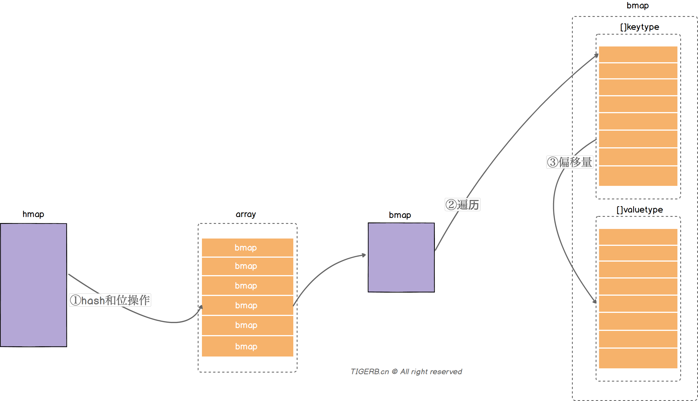
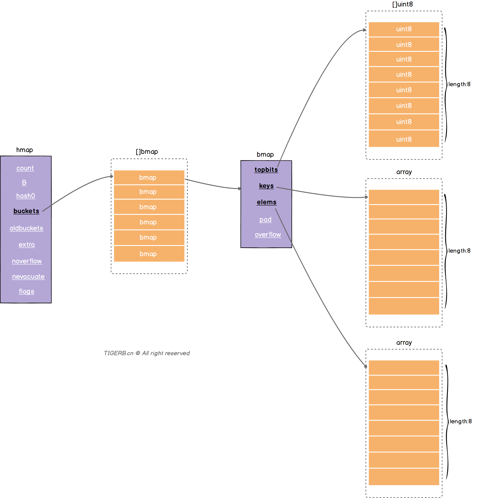
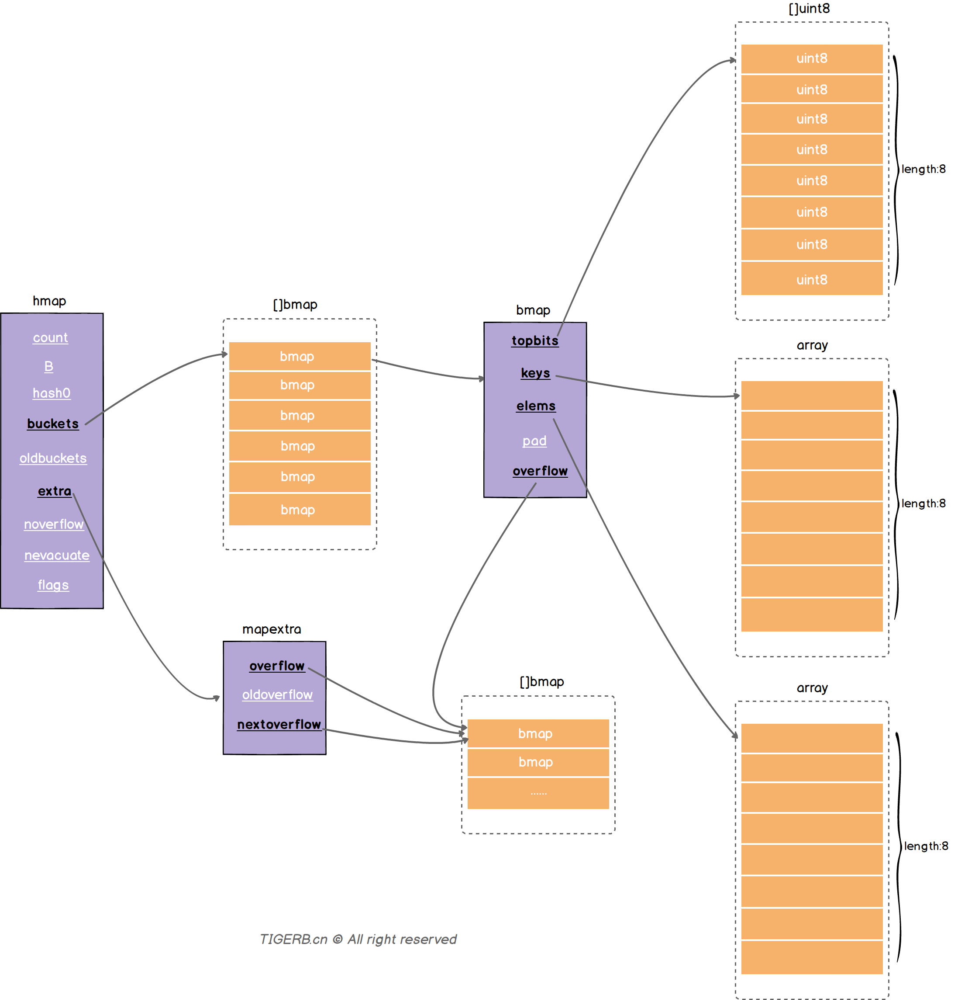

## 入门Go语言Map实现原理

[入门Go语言Map实现原理](http://tigerb.cn/2020/12/21/go-base/map/)

### 一般map实现思路

一般的Map会包含两个主要结构：

    数组：数组里的值指向一个链表
    链表：目的解决hash冲突的问题，并存放键值

读取一个key值的过程大致流程：

                   key
                    |
                    v                 
    +------------------------------------+
    |  key通过hash函数得到key的【hash】    |
    +------------------+-----------------+
                    |
                    v
    +------------------------------------+
    |       key的hash通过取模或者位操作     |
    |        得到key在数组上的【索引】      |
    +------------------------------------+
                    |
                    v
    +------------------------------------+
    |         通过索引找到对应的链表         |
    +------------------+-----------------+
                    |
                    v
    +------------------------------------+
    |       遍历链表对比key和目标key       |
    +------------------+-----------------+
                    |
                    v
    +------------------------------------+
    |         相等则返回value             |
    +------------------+-----------------+
                    |
                    v                
                  value


### Go语言里Map

Go语言解决hash冲突不是链表，实际主要用的数组(内存上的连续空间)，使用了两个数组分别存储键和值

    两个核心的结构体hmap和bmap
    bmap里有两个数组分别存放key和value



读取某个key的值的一个大致过程：

（1）通过hash函数获取目标key的【哈希】，哈希和数组的长度通过位操作获取数组位置的【索引】(备注：获取索引值的方式一般有取模或位操作，位操作的性能好些)

（2）遍历bmap里的键，和目标key对比获取【key的索引】(找不到则返回空值)

（3）根据【key的索引】通过计算偏移量，获取到对应value


### Go语言里Map的实现思路（🔥🔥🔥）

实现Map的两个核心结构体hmap和bmap

- hmap字段

```golang
type hmap struct {
	count     int  // 键值对的数量
	flags     uint8 // 状态标识，比如正在被写、buckets和oldbuckets在被遍历、等量扩容(Map扩容相关字段) 
	B         uint8 // 2^B=len(buckets) 
	noverflow uint16  // 溢出桶里bmap大致的数量
	hash0     uint32 // hash因子
	buckets    unsafe.Pointer // 指向一个数组(连续内存空间)，数组的类型为[]bmap，bmap类型就是存在键值对的结构下面会详细介绍，这个字段我们可以称之为正常桶
	oldbuckets unsafe.Pointer // 扩容时，存放之前的buckets(Map扩容相关字段)
	nevacuate  uintptr  // 分流次数，成倍扩容分流操作计数的字段(Map扩容相关字段)
	extra *mapextra // 溢出桶结构，正常桶里面某个bmap存满了，会使用这里面的内存空间存放键值对
}
```

- bmap字段

        topbits	长度为8的数组，[]uint8，元素为：key获取的hash的高8位，遍历时对比使用，提高性能。如下图所示
        keys	长度为8的数组，[]keytype，元素为：具体的key值。如下图所示
        elems	长度为8的数组，[]elemtype，元素为：键值对的key对应的值。如下图所示
        overflow	指向的hmap.extra.overflow溢出桶里的bmap，上面的字段topbits、keys、elems长度为8，最多存8组键值对，存满了就往指向的这个bmap里存
        pad	对齐内存使用的，不是每个bmap都有会这个字段，需要满足一定条件




- 溢出桶

“每个bmap结构最多存放8组键值对”，正常桶里的bmap存满了怎么办?

解决这个问题我们就要说到hmap.extra结构了，hmap.extra是个结构体

```golang
type mapextra struct {
    // 称之为溢出桶。和hmap.buckets的类型一样也是数组[]bmap，当正常桶bmap存满了的时候就使用hmap.extra.overflow的bmap。
    // 所以这里有个问题正常桶hmap.buckets里的bmap是怎么关联上溢出桶hmap.extra.overflow的bmap呢？
    overflow    *[]*bmap
    // 扩容时存放之前的overflow(Map扩容相关字段)
    oldoverflow *[]*bmap
    // 指向溢出桶里下一个可以使用的bmap
	nextOverflow *bmap
}
```

    问题：正常桶hmap.buckets里的bmap是怎么关联上溢出桶hmap.extra.overflow的bmap呢？

答：就是我们介绍bmap结构时里的bmap.overflow字段(如下图所示)。bmap.overflow是个指针类型，存放了对应使用的溢出桶hmap.extra.overflow里的bmap的地址。

    问题：正常桶hmap.buckets里的bmap是什么时候关联上溢出桶hmap.extra.overflow的bmap呢？

答：Map写操作的时候。(🔥🔥🔥  代码逻辑复杂！！！)


**当hmap存在溢出桶时，且当前溢出桶只被使用了一个bmap**时，我们可以得到如下的关系图：



同时我们可以看出正常桶的bmap和溢出桶的bmap实际构成了链表关系，所以这也解释了开篇我们说到的“Go里面Map的实现主要用到了数组”，其次还用到了链表。

通过一次读操作为例，看看读取某个key的值的一个大致过程：(🔥🔥🔥  代码逻辑复杂！！！)

