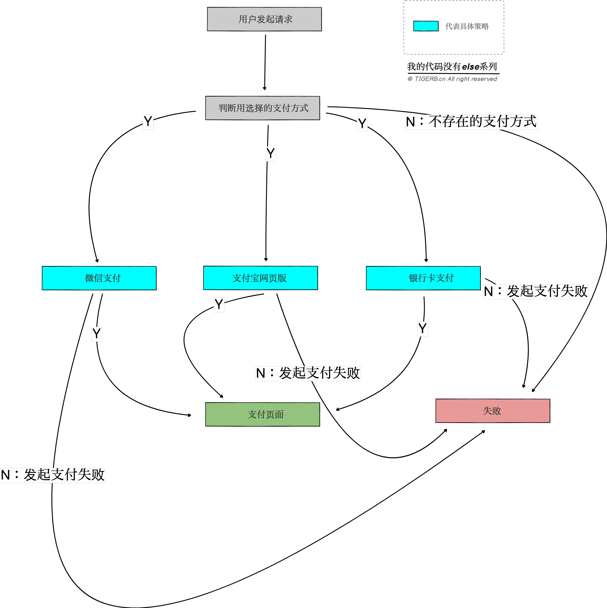

## 策略模式

### 1.什么是策略模式

    不同的算法按照统一的标准封装，客户端根据不同的场景，决策使用何种算法。

上面的概念的关键词：

    算法：就是行为
    标准：就是interface
    客户端：客户端是相对的，谁调用谁就是客户端
    场景：判断条件
    决策：判断的过程

### 2.什么真是业务场景可以使用策略模式

当代码的下一步面临选择的时候都可以使用「策略模式」，我们把不同选择的算法按照统一的标准封装，得到一类算法集的过程，就是实现「策略模式」的过程。

比如：

    缓存: 使用什么样的nosql
    存储: 使用什么样的DB
    支付: 使用什么样的支付方式

### 3.怎么使用策略模式(以支付为例)

    业务梳理
    业务流程图
    代码建模
    代码

- 业务梳理

用户可以使用：

    美团支付(策略)
    微信支付(策略)
    支付宝支付(策略)

- 业务流程图



- 代码建模

「策略模式」的核心是接口：

    PaymentInterface:
        Pay(ctx *Context) error 当前支付方式的支付逻辑
        Refund(ctx *Context) error 当前支付方式的退款逻辑

伪代码如下：

    // 定义一个支付接口
    - `PaymentInterface`
        + 抽象方法`Pay(ctx *Context) error`: 当前支付方式的支付逻辑
        + 抽象方法`Refund(ctx *Context) error`: 当前支付方式的退款逻辑

    // 定义具体的支付方式 实现接口`PaymentInterface`

    - 具体的微信支付方式`WechatPay`
        +  实现方法`Pay`: 支付逻辑
        +  实现方法`Refund`: 支付逻辑
    - 具体的支付宝支付网页版方式`AliPayWap`
        +  实现方法`Pay`: 支付逻辑
        +  实现方法`Refund`: 支付逻辑
    - 具体的支付宝支付网页版方式`BankPay`
        +  实现方法`Pay`: 支付逻辑
        +  实现方法`Refund`: 支付逻辑

    // 客户端代码
    通过接口参数pay_type的值判断是哪种支付方式策略


```golang
const (
	WECHAT_PAY = "wechat_pay" // 微信支付
	ALI_PAY    = "ali_pay"    // 支付宝支付
	BANK_PAY   = "bank_pay"   // 银行卡支付
)

type Context struct {
	// 用户选择的支付方式
	PayType string `json:pay_type`
}

type PaymentInterface interface {
	Pay(c *Context) error    // 支付
	Refund(c *Context) error // 退款
}

type WechatPay struct{}

func (p *WechatPay) Pay(ctx *Context) (err error) {
	fmt.Println(runFuncName(), "使用微信支付...")
	return
}
func (p *WechatPay) Refund(ctx *Context) (err error) {
	fmt.Println(runFuncName(), "使用微信退款...")
	return
}

type AliPay struct{}

func (p *AliPay) Pay(ctx *Context) (err error) {
	fmt.Println(runFuncName(), "使用支付宝支付...")
	return
}
func (p *AliPay) Refund(ctx *Context) (err error) {
	fmt.Println(runFuncName(), "使用支付宝退款...")
	return
}

type BankPay struct{}

func (p *BankPay) Pay(ctx *Context) (err error) {
	fmt.Println(runFuncName(), "使用银行卡支付...")
	return
}
func (p *BankPay) Refund(ctx *Context) (err error) {
	fmt.Println(runFuncName(), "使用银行卡退款...")
	return
}

func main() {
	// 相对于被调用的支付策略 这里就是支付策略的客户端
	ctx := &Context{
		PayType: "ali_pay",
	}

	// 获取支付方式
	var instance PaymentInterface
	switch ctx.PayType {
	case WECHAT_PAY:
		instance = &WechatPay{}
	case ALI_PAY:
		instance = &AliPay{}
	case BANK_PAY:
		instance = &BankPay{}
	default:
		panic("非法的支付方式")
	}
	instance.Pay(ctx)
}

// 获取正在运行的函数名
func runFuncName() string {
	pc := make([]uintptr, 1)
	runtime.Callers(2, pc)
	f := runtime.FuncForPC(pc[0])
	return f.Name()
}
```