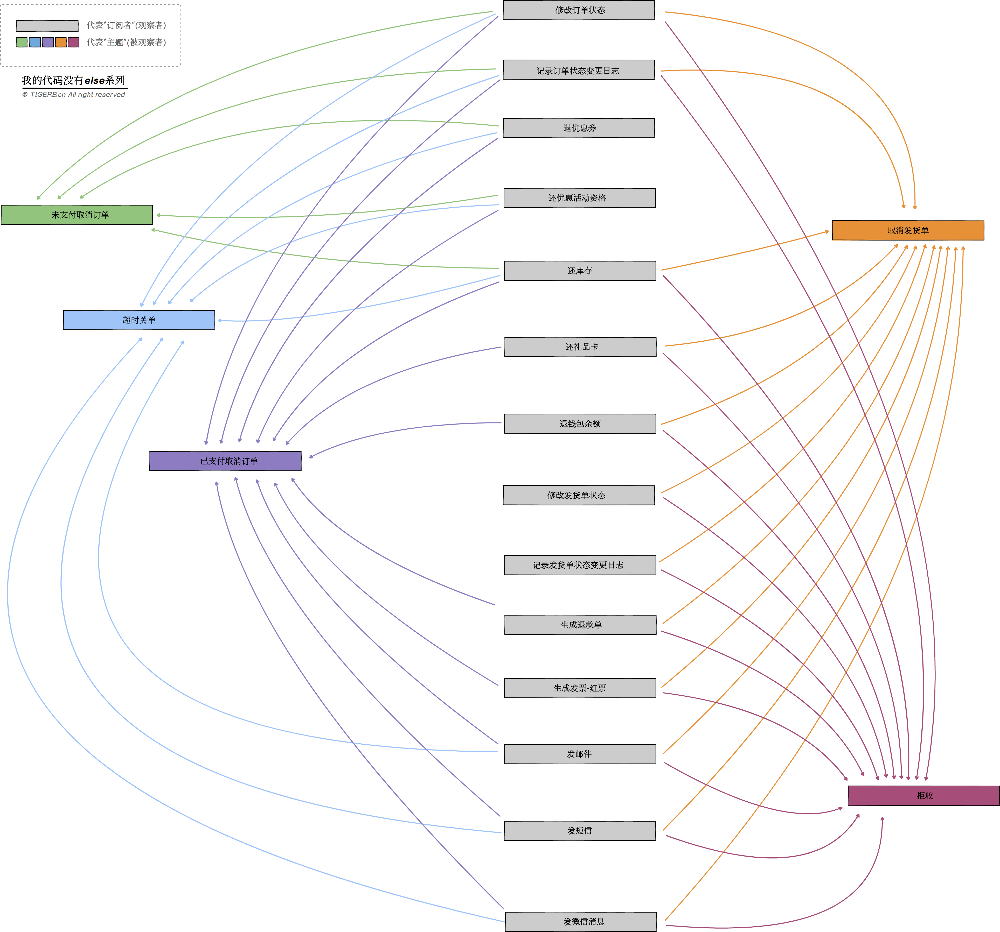

## 观察者模式

### 3.观察者模式概念

    “订阅者订阅主题，主题通知订阅者”

两个对象

    被观察者 -> 主题
    观察者 -> 订阅者

两个动作

    订阅 -> 订阅者订阅主题
    通知 -> 主题发生变动通知订阅者

观察者模式的优势：

    高内聚 -> 不同业务代码变动互不影响
    可复用 -> 新的业务(就是新的订阅者)订阅不同接口(主题，就是这里的接口)
    极易扩展 -> 新增接口(就是新增主题)；新增业务(就是新增订阅者)；

### 2.使用场景

    所有发生变更，需要通知的业务场景（只要发生了某些变化，需要通知依赖了这些变化的具体事物的业务场景。）

- 我们有哪些真实业务场景可以用「观察者模式」呢？

比如，订单逆向流，也就是订单成立之后的各种取消操作(不讨论售后)，主要有如下取消类型：

    未支付取消订单
    超时关单
    已支付取消订单（未生成发货单）
    取消发货单（未发货）
    拒收

在触发这些取消操作都要进行各种各样的子操作，显而易见不同的取消操作所涉及的子操作是存在交集的。其次，已支付取消订单的子操作应该是所有订单取消类型最全的，其他类型的复用代码即可，除了分装成函数片段，还有什么更好的封装方式吗？答案：「观察者模式」。

接着我们来分析下订单逆向流业务中的变与不变：

变：

    新增取消类型
    新增子操作
    修改某个子操作的逻辑
    取消类型和子操作的对应关系

不变：

    已存在的取消类型
    已存在的子操作(在外界看来)

### 3.如何使用观察者模式

    业务梳理
    业务流程图
    代码建模
    代码

- 业务梳理

所有存在的的逆向业务的子操作：

    修改订单状态
    记录订单状态变更日志
    退优惠券
    还优惠活动资格
    还库存
    还礼品卡
    退钱包余额
    修改发货单状态
    记录发货单状态变更日志
    生成退款单
    生成发票-红票
    发邮件
    发短信
    发微信消息

- 业务流程图



结论：

    不同的订单取消类型的子操作存在交集，子操作可被复用。
    子操作可被看作“订阅者”(也就是观察者)
    订单取消类型可被看作是“主题”(也就是被观察者)
    不同子操作(“订阅者”)(观察者)订阅订单取消类型(“主题”)(被观察者)
    订单取消类型(“主题”)(被观察者)通知子操作(“订阅者”)(观察者)

- 代码建模

「观察者模式」的核心是两个接口：

（1）“主题”(被观察者)接口Observable

    抽象方法Attach: 增加“订阅者”
    抽象方法Detach: 删除“订阅者”
    抽象方法Notify: 通知“订阅者”

（2）“订阅者”(观察者)接口ObserverInterface

    抽象方法Do: 自身的业务

订单逆向流的业务下，我们需要实现这两个接口:

    具体订单取消的动作实现“主题”接口Observable
    子逻辑实现“订阅者”接口ObserverInterface


伪代码：


    // ------------这里实现一个具体的“主题”------------

    具体订单取消的动作实现“主题”(被观察者)接口`Observable`。得到一个具体的“主题”:

    - 订单取消的动作的“主题”结构体`ObservableConcrete`
        +  成员属性`observerList []ObserverInterface`:订阅者列表
        +  具体方法`Attach`: 增加子逻辑
        +  具体方法`Detach`: 删除子逻辑
        +  具体方法`Notify`: 通知子逻辑

    // ------------这里实现所有具体的“订阅者”------------

    子逻辑实现“订阅者”接口`ObserverInterface`:

    - 具体“订阅者”也就是子逻辑`OrderStatus`
        +  实现方法`Do`: 修改订单状态
    - 具体“订阅者”也就是子逻辑`OrderStatusLog`
        +  实现方法`Do`: 记录订单状态变更日志
    - 具体“订阅者”也就是子逻辑`CouponRefund`
        +  实现方法`Do`: 退优惠券
    - 具体“订阅者”也就是子逻辑`PromotionRefund`
        +  实现方法`Do`: 还优惠活动资格
    - 具体“订阅者”也就是子逻辑`StockRefund`
        +  实现方法`Do`: 还库存
    - 具体“订阅者”也就是子逻辑`GiftCardRefund`
        +  实现方法`Do`: 还礼品卡
    - 具体“订阅者”也就是子逻辑`WalletRefund`
        +  实现方法`Do`: 退钱包余额
    - 具体“订阅者”也就是子逻辑`DeliverBillStatus`
        +  实现方法`Do`: 修改发货单状态
    - 具体“订阅者”也就是子逻辑`DeliverBillStatusLog`
        +  实现方法`Do`: 记录发货单状态变更日志
    - 具体“订阅者”也就是子逻辑`Refund`
        +  实现方法`Do`: 生成退款单
    - 具体“订阅者”也就是子逻辑`Invoice`
        +  实现方法`Do`: 生成发票-红票
    - 具体“订阅者”也就是子逻辑`Email`
        +  实现方法`Do`: 发邮件
    - 具体“订阅者”也就是子逻辑`Sms`
        +  实现方法`Do`: 发短信
    - 具体“订阅者”也就是子逻辑`WechatNotify`
        +  实现方法`Do`: 发微信消息


```golang
// 观察者的接口
type ObserverInterface interface {
	// 自身的业务
	Do(o Observable) error
}

// 被观察者
type Observable interface {
	Attach(observer ...ObserverInterface) Observable
	Detach(observer ObserverInterface) Observable
	Notify() error
}

// 一个具体的 订单状态变化的被观察者；ObservableConcrete实现了Observable的所有方法，继承Observable
//（question）为什么不直接把observerList 放到Observable里面（😅）
type ObservableConcrete struct {
	observerList []ObserverInterface
}

// 注册观察者
func (o *ObservableConcrete) Attach(observer ...ObserverInterface) Observable {
	o.observerList = append(o.observerList, observer...)
	return o
}

// 注销观察者
func (o *ObservableConcrete) Detach(observer ObserverInterface) Observable {
	if len(o.observerList) == 0 {
		return o
	}
	for k, item := range o.observerList {
		if observer == item {
			fmt.Println(runFuncName(), "注销:", reflect.TypeOf(observer))
			o.observerList = append(o.observerList[:k], o.observerList[k+1:]...)
		}
	}
	return o
}

// 通知观察者
func (o *ObservableConcrete) Notify() (err error) {
	for _, observer := range o.observerList {
		if err = observer.Do(o); err != nil {
			return err
		}
	}
	return nil
}

/* 具体业务 实现了ObserverInterface观察者接口  */

// 修改订单状态
type OrderStatus struct{}

func (os *OrderStatus) Do(o Observable) (err error) {
	fmt.Println(runFuncName(), "修改订单状态...")
	return
}

// 记录订单状态变更日志
type OrderStatusLog struct{}

func (os *OrderStatusLog) Do(o Observable) (err error) {
	fmt.Println(runFuncName(), "记录订单状态变更日志...")
	return
}

// 退还优惠券
type CouponRefund struct{}

func (os *CouponRefund) Do(o Observable) (err error) {
	fmt.Println(runFuncName(), "退还优惠券...")
	return
}

// 返还优惠活动资格
type PromotionRefund struct{}

func (os *PromotionRefund) Do(o Observable) (err error) {
	fmt.Println(runFuncName(), "返还优惠活动资格...")
	return
}

// 返还库存
type StockRefund struct{}

func (os *StockRefund) Do(o Observable) (err error) {
	fmt.Println(runFuncName(), "返还库存...")
	return
}

// 返还礼品卡
type GiftCardRefund struct{}

func (os *GiftCardRefund) Do(o Observable) (err error) {
	fmt.Println(runFuncName(), "返还礼品卡...")
	return
}

// 退钱包余额
type WalletRefund struct{}

func (os *WalletRefund) Do(o Observable) (err error) {
	fmt.Println(runFuncName(), "退钱包余额...")
	return
}

// 修改发货单状态
type DeliverBillStatus struct{}

func (os *DeliverBillStatus) Do(o Observable) (err error) {
	fmt.Println(runFuncName(), "修改发货单状态...")
	return
}

// 记录发货单状态变更日志
type DeliverBillStatusLog struct{}

func (os *DeliverBillStatusLog) Do(o Observable) (err error) {
	fmt.Println(runFuncName(), "记录发货单状态变更日志...")
	return
}

// 生成退款单
type Refund struct{}

func (os *Refund) Do(o Observable) (err error) {
	fmt.Println(runFuncName(), "生成退款单...")
	return
}

// 生成发票-红票
type Invoice struct{}

func (os *Invoice) Do(o Observable) (err error) {
	fmt.Println(runFuncName(), "生成发票-红票...")
	return
}

// 发邮件短信微信消息
type Message struct{}

func (os *Message) Do(o Observable) (err error) {
	fmt.Println(runFuncName(), "发邮件短信微信消息...")
	return
}

func main() {
	fmt.Println("=============未支付取消订单“主题”=================")
	orderUnPaidCancelSubject := &ObservableConcrete{}
	orderUnPaidCancelSubject.Attach(
		&OrderStatus{},
		&OrderStatusLog{},
		&CouponRefund{},
		&PromotionRefund{},
		&StockRefund{},
	)
	orderUnPaidCancelSubject.Notify()

	fmt.Println("=============超时关单“主题”=================")
	orderOvertimeSubject := &ObservableConcrete{}
	orderOvertimeSubject.Attach(
		&OrderStatus{},
		&OrderStatusLog{},
		&CouponRefund{},
		&PromotionRefund{},
		&StockRefund{},
		&Message{},
	)
	orderOvertimeSubject.Notify()

	fmt.Println("=============已支付取消订单“主题”=================")
	orderPaidCancelSubject := ObservableConcrete{}
	orderPaidCancelSubject.Attach(
		&OrderStatus{},
		&OrderStatusLog{},
		&CouponRefund{},
		&PromotionRefund{},
		&StockRefund{},
		&GiftCardRefund{},
		&WalletRefund{},
		&Refund{},
		&Invoice{},
		&Message{},
	)
	orderPaidCancelSubject.Notify()

	fmt.Println("=============取消发货“主题”=================")
	deliverBillCancelSubject := ObservableConcrete{}
	deliverBillCancelSubject.Attach(
		&OrderStatus{},
		&OrderStatusLog{},
		&DeliverBillStatus{},
		&DeliverBillStatusLog{},
		&StockRefund{},
		&GiftCardRefund{},
		&WalletRefund{},
		&Refund{},
		&Invoice{},
		&Message{},
	)
	deliverBillCancelSubject.Notify()

	fmt.Println("=============拒收“主题”=================")
	deliverBillRejectSubject := ObservableConcrete{}
	deliverBillRejectSubject.Attach(
		&OrderStatus{},
		&OrderStatusLog{},
		&DeliverBillStatus{},
		&DeliverBillStatusLog{},
		&StockRefund{},
		&GiftCardRefund{},
		&WalletRefund{},
		&Refund{},
		&Invoice{},
		&Message{},
	)
	deliverBillRejectSubject.Notify()
}

// 获取正在运行的函数名
func runFuncName() string {
	pc := make([]uintptr, 1)
	runtime.Callers(2, pc)
	f := runtime.FuncForPC(pc[0])
	return f.Name()
}
```

最后总结下，「观察者模式」抽象过程的核心是：

	被依赖的“主题”
	被通知的“订阅者”
	“订阅者”按需订阅“主题”
	“主题”变化通知“订阅者”