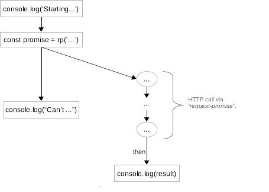
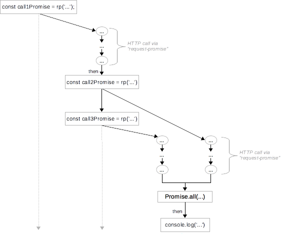
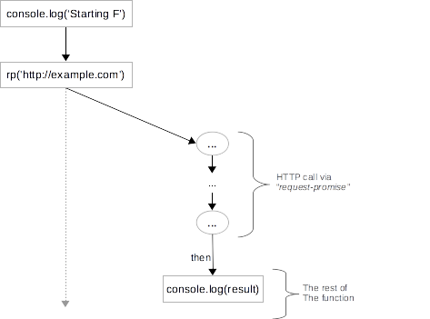
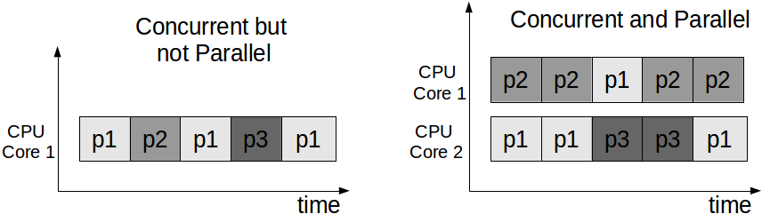

### 用图和示例解释Await and Async

**目录**

[TOC]
## Introduction
>ES7中的async/await使得异步调用更加方便。如果你在某些地方使用大量的promise和callback异步获取数据，用async/await结构会使代码更加的简洁、可维护性更佳。
>这篇文章会用图和示例解释Await and Async
>深入理解之前，我们先浏览一下promise。当然，如果你了解过promise，可以跳过

##Promises
>在javascript当中，promise表示是非阻塞异步执行的抽象，如果你有了解的话，promise就像Java的future或者C#的Task一样
>通常用promise进行网络请求和I/O操作，比如读取文件或者发送http请求。而不是阻止线程的执行，生成一个异步的promise，然后当promise方法实现的时候执行then中的回调函数，这个回调函数滋身返回一个promise，因此，可以链式调用promise
>在所有的例子当中，安装和引入 request-promise库，像这样
```javascript
const rp = require('request-promise');
```
我们生成一个简单的http get请求，其返回一个promise
```javascript
const promise = rp('http://example.com/')
```
看一个例子先
```javascript
console.log('Starting Execution');
const promise = rp('http://example.com/');
promise.then(result => console.log(result));
console.log("Can't know if promise has finished yet...");
```
在第2行创建一个promise，然后再第三行追加一个回调函数，因为promise是异步的，所以我们来到了第4行，我们不知道这个promise是否成功。多次运行这段代码每次的结果也不尽相同，通常，任何promise之后的代码会同promise一起执行
在promise完成之前，没有任何合理的方法能阻止当前的一系列操作，不同于java的Future.get，允许阻止当前的线程，直到Future完成。在javascript当中，等待promise完成比较棘手，只能通过在then中添加回调函数的方法解决这个问题

>下图描绘了这个过程


通过then添加的回调函数只有当promise执行成功的时候才会执行，如果promise执行失败（比如，网络请求失败），回调函数就不会执行。要处理promise错误的情况，可以通过在catch中添加回调函数，像这样：
```
rp('http://example.com/').
then(() => console.log('Success')).
catch(e => console.log(`Failed: ${e}`))
```
为了测试的目的，我们随意的创建伪Promise，用Promise.resolve表示成功，Promise.reject表示失败
```
const success = Promise.resolve('Resolved');
// Will print "Successful result: Resolved"
success.
	then(result => console.log(`Successful result: ${result}`)).
    catch(e => console.log(`Failed with: ${e}`))
const fail = Promise.reject('Err');
// Will print "Failed with: Err"
fail.
    then(result => console.log(`Successful result: ${result}`)).
    catch(e => console.log(`Failed with: ${e}`))
```
## The Problem - Composing Promises
>单个的promise简单。然而，我们要用多个promise才能实现复杂的异步逻辑，书写所有then函数和匿名函数很容易失控

>比如要解决下面这个问题
```
发送一个http请求，等待他完成，打印结果
创建另外两个http请求
当他们都完成之后，打印结果
```
>下面这个小节演示如何解决这个问题
```
// Make the first call
const call1Promise = rp('http://example.com/');
call1Promise.then(result1 => {
    // Executes after the first request has finished
    console.log(result1);
    const call2Promise = rp('http://example.com/');
    const call3Promise = rp('http://example.com/');
    return Promise.all([call2Promise, call3Promise]);
}).then(arr => {
    // Executes after both promises have finished
    console.log(arr[0]);
    console.log(arr[1]);
})
```
>创建一个http请求，当他成功的时候去执行回调函数；在回调函数中，为后面的http请求创建两外两个Promise，这两个promise都执行完成后，去执行一个回调函数，需要通过promise.all实现单一的Promise解决两个promise都完成这个时机；因为callback的结果是一个promise，所有需要另一个then打印结果

>下图描绘了这个过程


>为这么一个简单的问题，需要用两个then回调函数，而且不得不调用promise.all同步当前的promise，如果要执行更多的同步操作和错误处理怎么办？这种方法会产生大量的调用的和回调函数

## Async Functions
>异步方法是定义返回promise函数的快捷方式

>下面的例子是相等的
```
function f() {
    return Promise.resolve('TEST');
}
// asyncF is equivalent to f!
async function asyncF() {
    return 'TEST';
}
```
>同样，抛出异常的异步方法和返回reject的promise方法相同
```
function f() {
    return Promise.reject('Error');
}
// asyncF is equivalent to f!
async function asyncF() {
    throw 'Error';
}
```

## Await
>当创建一个promise，不能同步等待他完成；只能通过then回调。等待promise，不鼓励阻塞的编码。否则，开发者想尝试阻塞操作，因为他比promise和回调更容易。
>然饿，为了同步promise，我们不得不让其彼此等待，也就是一个异步操作可以等待另一个异步操作的完成。但是javascript解释器如何知道一个操作是否在promise中运行
>async关键字，每个async方法返回一个promise，这样javascript解释器会用promise封装async方法，然后异步执行。解释器会因此让他们等待其他promise先完成。
>await关键字只能在asunc方法中使用，它允许在promise中异步等待。如果在async方法之外用promise，那么只能用then方式执行回调函数
```
async function f(){
    // response will evaluate as the resolved value of the promise
    const response = await rp('http://example.com/');
    console.log(response);
}
// We can't use await outside of async function.
// We need to use then callbacks ....
f().then(() => console.log('Finished'));
```
>现在我们来面的问题
```
// Encapsulate the solution in an async function
async function solution() {
    // Wait for the first HTTP call and print the result
    console.log(await rp('http://example.com/'));
    // Spawn the HTTP calls without waiting for them - run them concurrently
    const call2Promise = rp('http://example.com/');  // Does not wait!
    const call3Promise = rp('http://example.com/');  // Does not wait!
    // After they are both spawn - wait for both of them
    const response2 = await call2Promise;
    const response3 = await call3Promise;
    console.log(response2);
    console.log(response3);
}
// Call the async function
solution().then(() => console.log('Finished'));
```
>在上面的代码片段中，我们在一个async函数封装解决方案。这允许我们直接等待promise，从而避免了需要再回调。最后，我们调用async函数，简单地生成一个promsie它将调用其他promise的逻辑
>事实上在第一个例子中（没有异步/等待），promise将并行运行。在这种情况下，我们做同样的事情（第7行）。注意，我们不用等到线9-10日，当我们块的执行直到两个promise都完成。后来，我们知道这两个promise都已经解决了（Promise.all(...).then(...))
底层计算过程相当于前一节描述的过程。然而，代码更易读和直接。
>引擎会在后台将async/await解释成promise和then回调函数，也就是promise的语法唐，每次我们调用async，引擎都会创建一个promise，async中剩下的操作将会存入then回调函数中

>考虑一下下面这个例子
```
async function f() {
    console.log('Starting F');
    const result = await rp('http://example.com/');
    console.log(result);
}
```
>下面描绘f()背后的运行逻辑，因为f()是async修饰，所以他和他的调用函数并行执行


f()方法创建一个promise，同时将剩余的部分封装到回调函数中，这部分会在promise结束之后执行

##Error Handling
>在之前的例子当中，都假设promise正确执行，因此async方法有返回值。如果一个async在内部抛出异常，就用标准的try/catch解决
```
async function f() {
    try {
        const promiseResult = await Promise.reject('Error');
    } catch (e){
        console.log(e);
    }
}
```
如果async函数不处理异常，无论是通过reject promise或者一个错误，他将返回reject promise
```
async function f() {
    // Throws an exception
    const promiseResult = await Promise.reject('Error');
}
// Will print "Error"
f().
    then(() => console.log('Success')).
    catch(err => console.log(err))
async function g() {
    throw "Error";
}
// Will print "Error"
g().
    then(() => console.log('Success')).
    catch(err => console.log(err))
```
这给我们提供了一种简便的方法，通过已知的异常处理机制来处理被拒绝的承诺。
##Discussion
>Async/await提供了一种更加简洁方式实现promise，单在一些情况下，Async/await 不能代替promise，例如，在普通方法或者全局作用域调用async，这里就不能使用await，只能通过promise方式
```
async function fAsync() {
    // actual return value is Promise.resolve(5)
    return 5;
}
// can't call "await fAsync()". Need to use then/catch
fAsync().then(r => console.log(`result is ${r}`));
```
我通常尝试将大部分异步逻辑封装在一个或几个异步函数中，我从非异步代码调用异步函数。这最大限度地减少了我需要编写的then / catch回调的数量。

async / await结构是用于更简洁地使用promise的语法糖。每个异步/等待构造可以用简单的promise来重写。最终，这是一个风格和简洁的问题。

有的学者指出并发性和并行性是有区别的。看看Rob Pike关于这个话题或我以前的帖子的话题。并发是关于组合独立进程（在术语过程的一般意义上）一起工作，而并行是关于实际同时执行多个进程。并发是关于应用程序的设计和结构，而并行是关于实际的执行。

让我们以一个多线程应用程序为例。应用程序分离成线程定义了它的并发模型。这些线程在可用内核上的映射定义了其级别或并行性。一个并发系统可以在单个处理器上有效地运行，在这种情况下它不是并行的。

就此而言，promise允许我们将一个程序分解为并行的并行模块，也可以不并行运行。 实际的JavaScript执行是否并行取决于实现。 例如，Node Js是单线程的，如果一个promise是CPU绑定的，你就不会看到太多的并行性。 但是，如果你通过像Nashorn这样的东西把你的代码编译成java字节码，那么理论上你可能能够在不同核心上映射CPU绑定的promise，并且实现并行性。 因此，在我看来，promise（无论是链式或通过async/await表达）构成了一个JavaScript应用程序的并发模型。

