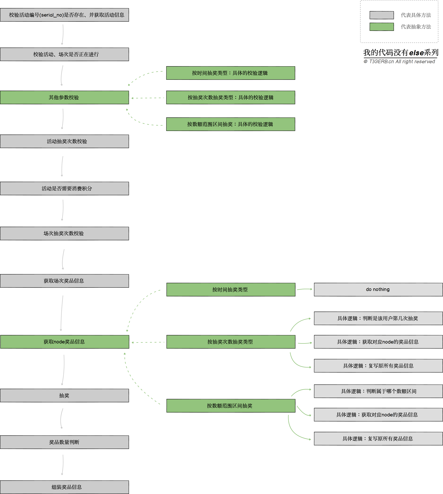

## 模板模式

### 1. 模板模式的概念

抽象类里定义好**算法的执行步骤**和**具体算法**，以及可能发生变化的算法定义为**抽象方法**。不同的子类继承该抽象类，并实现父类的抽象方法。

模板模式的优势：

    不变的算法被继承复用：不变的部分高度封装、复用。
    变化的算法子类继承并具体实现：变化的部分子类只需要具体实现抽象的部分即可，方便扩展，且可无限扩展。

### 2. 使用场景

    算法执行的步骤是稳定不变的，但是具体的某些算法可能存在变化的场景。

### 3. 真实业务场景

（1）抽奖系统的抽奖接口，为什么：

    抽奖的步骤是稳定不变的 -> 不变的算法执行步骤
    不同抽奖类型活动在某些逻辑处理方式可能不同 -> 变的某些算法

### 4.如何使用模板模式

    业务梳理
    业务流程图
    代码建模
    代码


- 业务梳理

各种抽奖场景（红包雨、糖果雨、打地鼠、大转盘(九宫格)、考眼力、答题闯关、游戏闯关、支付刮刮乐、积分刮刮乐等等），按照真实业务需求梳理了以下抽奖业务抽奖接口的大致文本流程。



- 代码建模

    一个抽象类
    - 具体共有方法`Run`，里面定义了算法的执行步骤
    - 具体私有方法，不会发生变化的具体方法
    - 抽象方法，会发生变化的方法

    子类一(按时间抽奖类型)
    - 继承抽象类父类
    - 实现抽象方法

    子类二(按抽奖次数抽奖类型)
    - 继承抽象类父类
    - 实现抽象方法

    子类三(按数额范围区间抽奖)
    - 继承抽象类父类
    - 实现抽象方法


但是golang里面没有继承的概念，我们就把对抽象类里抽象方法的依赖转化成对接口interface里抽象方法的依赖，同时也可以利用合成复用的方式“继承”模板。UML图（😅）

    抽象行为的接口`BehaviorInterface`(包含如下需要实现的方法)
    - 其他参数校验的方法`checkParams`
    - 获取node奖品信息的方法`getPrizesByNode`

    抽奖结构体类
    - 具体共有方法`Run`，里面定义了算法的执行步骤
    - 具体私有方法`checkParams` 里面的逻辑实际依赖的接口BehaviorInterface.checkParams(ctx)的抽象方法
    - 具体私有方法`getPrizesByNode` 里面的逻辑实际依赖的接口BehaviorInterface.getPrizesByNode(ctx)的抽象方法
    - 其他具体私有方法，不会发生变化的具体方法

    实现`BehaviorInterface`的结构体一(按时间抽奖类型)
    - 实现接口方法

    实现`BehaviorInterface`的结构体二(按抽奖次数抽奖类型)
    - 实现接口方法

    实现`BehaviorInterface`的结构体三(按数额范围区间抽奖)
    - 实现接口方法

```golang
package main

import (
	"fmt"
	"runtime"
)

/* 设计模式之----模板模式 */

const (
	ActTypeTime   int32 = 1 // 按时间抽奖
	ActTypeTimes  int32 = 2 // 按抽奖次数抽奖
	ActTypeAmount int32 = 3 // 按数额范围区间抽奖
)

// context上下文
type Context struct {
	ActInfo *ActInfo
}

// actType上下文
type ActInfo struct {
	// 活动抽奖类型（1，2，3）
	ActivityType int32
	// ......其他字段
}

// 不同抽奖类型的行为差异的抽象接口
type BehabiorInterface interface {
	// 参数校验
	checkParams(ctx *Context) error
	// 获取node奖品信息
	getPrizeByNode(ctx *Context) error
}

// TimeDraw 具体抽奖行为。按时间抽奖类型，比如红包雨
type TimeDraw struct{}

func (draw TimeDraw) checkParams(ctx *Context) (err error) {
	fmt.Println(runFuncName(), "按时间抽奖类型：特殊参数校验")
	return
}
func (draw TimeDraw) getPrizeByNode(ctx *Context) (err error) {
	fmt.Println(runFuncName(), "do nothing(抽取该场次的奖品即可，无需其他逻辑)...")
	return
}

// TimeDraw 具体抽奖行为。按抽奖次数抽奖类型 比如答题闯关
type TimesDraw struct{}

func (draw TimesDraw) checkParams(ctx *Context) (err error) {
	fmt.Println(runFuncName(), "按抽奖次数抽奖类型:特殊参数校验...")
	return
}
func (draw TimesDraw) getPrizeByNode(ctx *Context) (err error) {
	fmt.Println(runFuncName(), "\n1.判断属于哪个数额区间... \n2.获取对应node的奖品信息...\n3.复写原所有奖品信息(抽取该node节点的奖品)...")
	return
}

// TimeDraw 具体抽奖行为。按数额范围区间抽奖 比如订单金额刮奖
type AmountDraw struct{}

func (draw AmountDraw) checkParams(ctx *Context) (err error) {
	fmt.Println(runFuncName(), "按数额范围区间抽奖:特殊参数校验...")
	return
}
func (draw AmountDraw) getPrizeByNode(ctx *Context) (err error) {
	fmt.Println(runFuncName(), "\n1.判断属于哪个数额区间... \n2.获取对应node的奖品信息...\n3.复写原所有奖品信息(抽取该node节点的奖品)...")
	return
}

// 抽奖模板
type Lottery struct {
	// 不同抽奖类型的抽象行为
	concreteBehavior BehabiorInterface
}

func (lottery *Lottery) Run(ctx *Context) (err error) {
	// 具体方法：校验活动编号是否存在、并获取活动信息
	if err = lottery.checkSerialNo(ctx); err != nil {
		return err
	}

	// 具体方法：校验活动、场次是否在进行
	if err = lottery.checkStatus(ctx); err != nil {
		return err
	}

	// 抽象方法：其他参数校验
	if err = lottery.checkParams(ctx); err != nil {
		return err
	}

	// 具体方法：活动抽奖次数校验（同时扣减）
	if err = lottery.checkTimesByAct(ctx); err != nil {
		return err
	}

	// 具体方法：活动是否需要消费积分
	if err = lottery.consumePointByAct(ctx); err != nil {
		return err
	}

	// 具体方法：场次抽奖次数校验（同时扣减）
	if err = lottery.checkTimesBySession(ctx); err != nil {
		return err
	}

	// 具体方法：获取场次奖品信息
	if err = lottery.getPrizesBySession(ctx); err != nil {
		return err
	}

	// 抽象方法：获取node奖品信息
	if err = lottery.getPrizeByNode(ctx); err != nil {
		return err
	}

	// 具体方法：抽奖
	if err = lottery.drawPrizes(ctx); err != nil {
		return err
	}

	// 具体方法：奖品数量判断
	if err = lottery.checkPrizesStock(ctx); err != nil {
		return err
	}

	// 具体方法：组装奖品信息
	if err = lottery.packagePrizeInfo(ctx); err != nil {
		return err
	}
	return
}

func (lottery *Lottery) checkSerialNo(ctx *Context) (err error) {
	fmt.Println(runFuncName(), "校验活动编号是否存在、并获取活动信息")
	// 获取活动信息伪代码
	ctx.ActInfo = &ActInfo{
		ActivityType: ActTypeTimes,
	}
	// 获取当前抽奖类型的具体行为
	switch ctx.ActInfo.ActivityType {
	case 1:
		lottery.concreteBehavior = &TimeDraw{}
	case 2:
		lottery.concreteBehavior = &TimesDraw{}
	case 3:
		lottery.concreteBehavior = &AmountDraw{}
	default:
		return fmt.Errorf("不能存在的活动类型")
	}
	return
}

func (lottery *Lottery) checkStatus(ctx *Context) (err error) {
	fmt.Println(runFuncName(), "校验活动、场次是否在进行")
	return
}

// 不同场景变化的算法，传华为依赖抽象
func (lottery *Lottery) checkParams(ctx *Context) (err error) {
	// 实际依赖的接口的抽象方法
	return lottery.concreteBehavior.checkParams(ctx)
}
func (lottery *Lottery) checkTimesByAct(ctx *Context) (err error) {
	fmt.Println(runFuncName(), "活动抽奖次数校验")
	return
}

func (lottery *Lottery) consumePointByAct(ctx *Context) (err error) {
	fmt.Println(runFuncName(), "活动是否需要消费积分......")
	return
}
func (lottery *Lottery) checkTimesBySession(ctx *Context) (err error) {
	fmt.Println(runFuncName(), "场次抽奖次数校验（同时扣减）......")
	return
}
func (lottery *Lottery) getPrizesBySession(ctx *Context) (err error) {
	fmt.Println(runFuncName(), "获取场次奖品信息......")
	return
}

// 不同场景变化的算法 转化为依赖抽象
func (lottery *Lottery) getPrizeByNode(ctx *Context) (err error) {
	// 实际依赖的接口的抽象方法
	return lottery.concreteBehavior.getPrizeByNode(ctx)
}

func (lottery *Lottery) drawPrizes(ctx *Context) (err error) {
	fmt.Println(runFuncName(), "抽奖......")
	return
}
func (lottery *Lottery) checkPrizesStock(ctx *Context) (err error) {
	fmt.Println(runFuncName(), "奖品数量判断......")
	return
}
func (lottery *Lottery) packagePrizeInfo(ctx *Context) (err error) {
	fmt.Println(runFuncName(), "组装奖品信息......")
	return
}

func main() {
	(&Lottery{}).Run(&Context{})
}

// 获取正在运行的函数名
func runFuncName() string {
	pc := make([]uintptr, 1)
	runtime.Callers(2, pc)
	f := runtime.FuncForPC(pc[0])
	return f.Name()
}

```

## 结语

最后总结下，「模板模式」抽象过程的核心是把握不变与变：

- 不变：Run方法里的抽奖步骤 -> 被继承复用
- 变：不同场景下 -> 被具体实现

	checkParams参数校验逻辑
	getPrizesByNode获取该节点奖品的逻辑