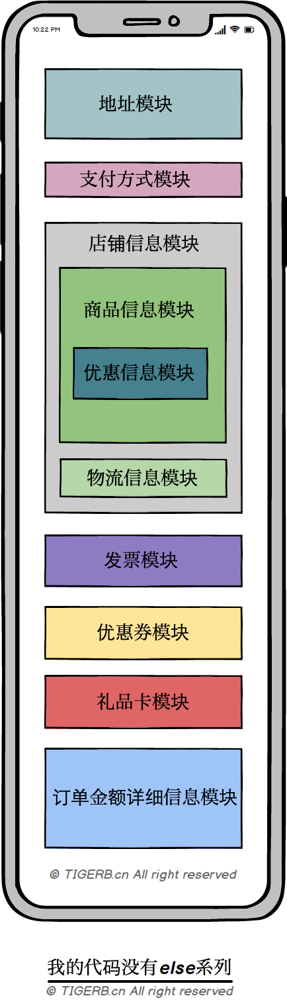

## 组合模式

### 1.组合模式概念

    一个具有层级关系的对象由一系列拥有父子关系的对象通过树形结构组成。

组合模式的优势：

    所见即所码：你所看见的代码结构就是业务真实的层级关系，比如Ui界面你真实看到的那样。
    高度封装：单一职责。
    可复用：不同业务场景，相同的组件可被重复使用。

### 2.使用场景

前端大行组件化的当今，我们在写后端接口代码的时候还是按照业务思路一头写到尾吗？我们是否可以思索，「后端接口业务代码如何可以简单快速组件化？」，答案是肯定的，这就是「组合模式」的作用。

我们利用「组合模式」的定义和前端模块的划分去构建后端业务代码结构：

    前端单个模块 -> 对应后端：具体单个类 -> 封装的过程
    前端模块父子组件 -> 对应后端：父类内部持有多个子类(非继承关系，合成复用关系) -> 父子关系的树形结构

以“复杂的订单结算页面”为例，下面是某东的订单结算页面：


从页面的展示形式上，可以看出：

页面由多个模块构成，比如：

    地址模块
    支付方式模块
    店铺模块
    发票模块
    优惠券模块
    某豆模块
    礼品卡模块
    订单详细金额模块

单个模块可以由多个子模块构成；店铺模块，又由如下模块构成：

    商品模块
    售后模块
    优惠模块
    物流模块

### 3.如何使用组合模式

    业务梳理
    业务流程图
    代码建模
    代码

- 业务梳理

按照如上某东的订单结算页面的示例，我们得到了如下的订单结算页面模块组成图：


- 代码建模

责任链模式主要类主要包含如下特性：

成员属性

    ChildComponents: 子组件列表 -> 稳定不变的

成员方法

    Mount: 添加一个子组件 -> 稳定不变的
    Remove: 移除一个子组件 -> 稳定不变的
    Do: 执行组件&子组件 -> 变化的

套用到订单结算页面信息接口伪代码实现如下：

	一个父类(抽象类)：
	- 成员属性
		+ `ChildComponents`: 子组件列表
	- 成员方法
		+ `Mount`: 实现添加一个子组件
		+ `Remove`: 实现移除一个子组件
		+ `Do`: 抽象方法

	组件一，订单结算页面组件类(继承父类、看成一个大的组件)： 
	- 成员方法
		+ `Do`: 执行当前组件的逻辑，执行子组件的逻辑

	组件二，地址组件(继承父类)：
	- 成员方法
		+ `Do`: 执行当前组件的逻辑，执行子组件的逻辑

	组件三，支付方式组件(继承父类)：
	- 成员方法
		+ `Do`: 执行当前组件的逻辑，执行子组件的逻辑

	组件四，店铺组件(继承父类)：
	- 成员方法
		+ `Do`: 执行当前组件的逻辑，执行子组件的逻辑

	组件五，商品组件(继承父类)：
	- 成员方法
		+ `Do`: 执行当前组件的逻辑，执行子组件的逻辑

	组件六，优惠信息组件(继承父类)：
	- 成员方法
		+ `Do`: 执行当前组件的逻辑，执行子组件的逻辑

	组件七，物流组件(继承父类)：
	- 成员方法
		+ `Do`: 执行当前组件的逻辑，执行子组件的逻辑

	组件八，发票组件(继承父类)：
	- 成员方法
		+ `Do`: 执行当前组件的逻辑，执行子组件的逻辑

	组件九，优惠券组件(继承父类)：
	- 成员方法
		+ `Do`: 执行当前组件的逻辑，执行子组件的逻辑

	组件十，礼品卡组件(继承父类)：
	- 成员方法
		+ `Do`: 执行当前组件的逻辑，执行子组件的逻辑

	组件十一，订单金额详细信息组件(继承父类)：
	- 成员方法
		+ `Do`: 执行当前组件的逻辑，执行子组件的逻辑
	组件十二，售后组件(继承父类，未来扩展的组件)：
	- 成员方法
		+ `Do`: 执行当前组件的逻辑，执行子组件的逻辑

golang里没有的继承的概念，要复用成员属性ChildComponents、成员方法Mount、成员方法Remove怎么办呢？我们使用合成复用的特性变相达到“继承复用”的目的，如下：

	一个接口(interface)：
	+ 抽象方法`Mount`: 添加一个子组件
	+ 抽象方法`Remove`: 移除一个子组件
	+ 抽象方法`Do`: 执行组件&子组件

	一个基础结构体`BaseComponent`：
	- 成员属性
		+ `ChildComponents`: 子组件列表
	- 成员方法
		+ 实体方法`Mount`: 添加一个子组件
		+ 实体方法`Remove`: 移除一个子组件
		+ 实体方法`ChildsDo`: 执行子组件

	组件一，订单结算页面组件类： 
	- 合成复用基础结构体`BaseComponent` 
	- 成员方法
		+ `Do`: 执行当前组件的逻辑，执行子组件的逻辑

	组件二，地址组件：
	- 合成复用基础结构体`BaseComponent` 
	- 成员方法
		+ `Do`: 执行当前组件的逻辑，执行子组件的逻辑

	组件三，支付方式组件：
	- 合成复用基础结构体`BaseComponent` 
	- 成员方法
		+ `Do`: 执行当前组件的逻辑，执行子组件的逻辑

	...略

	组件十一，订单金额详细信息组件：
	- 合成复用基础结构体`BaseComponent` 
	- 成员方法
		+ `Do`: 执行当前组件的逻辑，执行子组件的逻辑

```golang
type Context struct{}

// Component 组件接口。Interface定义了一个或一组method(s)，这些method(s)只有函数签名，没有具体的实现代码
type Component interface {
	// 添加一个子组件
	Mount(c Component, components ...Component) error
	// 移除一个子组件
	Remove(c Component) error
	// 执行组件&子组件
	Do(c *Context) error
}

// BaseComponent 基础组件。实现了Component接口
type BaseComponent struct {
	ChildComponents []Component
}

// Mount 第二个参数什么意思😅。...Component可变参数，那为什么不直接用一个可变参数，而要用两个参数呢（question）
func (bc *BaseComponent) Mount(c Component, components ...Component) (err error) {
	bc.ChildComponents = append(bc.ChildComponents, c)
	if len(components) == 0 {
		return
	}
	bc.ChildComponents = append(bc.ChildComponents, components...)
	return
}

func (bc *BaseComponent) Remove(c Component) (err error) {
	if len(bc.ChildComponents) == 0 {
		return
	}
	for k, child := range bc.ChildComponents {
		fmt.Println(runFuncName(), "移除：", reflect.TypeOf(child))
		bc.ChildComponents = append(bc.ChildComponents[:k], bc.ChildComponents[k+1:]...)
	}
	return
}

// 执行组件&子组件
func (bc *BaseComponent) Do(c *Context) (err error) {
	return
}

// 执行子组件
func (bc *BaseComponent) ChildsDo(c *Context) (err error) {
	for _, child := range bc.ChildComponents {
		if err = child.Do(c); err != nil {
			return err
		}
	}
	return
}


/* 具体业务 */

// 订单结算页面组件
type CheckoutPageComponent struct {
	// 合成复用基础组件（用组合代替继承（question））：每当一个结构字段嵌入到另一个域中时, 就可以选择访问嵌入字段, 就像它们是外部结构的一部分一样
	BaseComponent
}

func (bc *CheckoutPageComponent) Do(c *Context) (err error) {
	// 当前组件的业务逻辑
	fmt.Println(runFuncName(), "订单结算页面组件...")
	// 执行子组件 （相当于调用bc.BaseComponent.ChildsDo(c)）
	bc.ChildsDo(c)
	return
}

// 地址组件
type AddressComponent struct {
	// 合成复用基础组件
	BaseComponent
}

func (bc *AddressComponent) Do(c *Context) (err error) {
	// 当前组件的业务逻辑
	fmt.Println(runFuncName(), "地址组件...")
	// 执行子组件
	bc.ChildsDo(c)
	return
}

// 支付方式组件
type PayMethodComponent struct {
	// 合成复用基础组件
	BaseComponent
}

func (bc *PayMethodComponent) Do(c *Context) (err error) {
	// 当前组件的业务逻辑
	fmt.Println(runFuncName(), "支付方式组件...")
	// 执行子组件
	bc.ChildsDo(c)
	return
}

// 店铺组件
type StoreComponent struct {
	// 合成复用基础组件
	BaseComponent
}

func (bc *StoreComponent) Do(c *Context) (err error) {
	// 当前组件的业务逻辑
	fmt.Println(runFuncName(), "店铺组件...")
	// 执行子组件
	bc.ChildsDo(c)
	return
}

// 商品组件
type SkuComponent struct {
	// 合成复用基础组件
	BaseComponent
}

func (bc *SkuComponent) Do(c *Context) (err error) {
	// 当前组件的业务逻辑
	fmt.Println(runFuncName(), "商品组件...")
	// 执行子组件
	bc.ChildsDo(c)
	return
}

// 优惠信息组件
type PromotionComponent struct {
	// 合成复用基础组件
	BaseComponent
}

func (bc *PromotionComponent) Do(c *Context) (err error) {
	// 当前组件的业务逻辑
	fmt.Println(runFuncName(), "优惠信息组件...")
	// 执行子组件
	bc.ChildsDo(c)
	return
}

// 物流组件
type ExpressComponent struct {
	// 合成复用基础组件
	BaseComponent
}

func (bc *ExpressComponent) Do(c *Context) (err error) {
	// 当前组件的业务逻辑
	fmt.Println(runFuncName(), "物流组件...")
	// 执行子组件
	bc.ChildsDo(c)
	return
}

// 售后服务组件
type AftersaleComponent struct {
	// 合成复用基础组件
	BaseComponent
}

func (bc *AftersaleComponent) Do(c *Context) (err error) {
	// 当前组件的业务逻辑
	fmt.Println(runFuncName(), "售后服务组件...")
	// 执行子组件
	bc.ChildsDo(c)
	return
}

// 发票组件
type InvoiceComponent struct {
	// 合成复用基础组件
	BaseComponent
}

func (bc *InvoiceComponent) Do(c *Context) (err error) {
	// 当前组件的业务逻辑
	fmt.Println(runFuncName(), "发票组件...")
	// 执行子组件
	bc.ChildsDo(c)
	return
}

// 优惠券组件
type CouponComponent struct {
	// 合成复用基础组件
	BaseComponent
}

func (bc *CouponComponent) Do(c *Context) (err error) {
	// 当前组件的业务逻辑
	fmt.Println(runFuncName(), "优惠券组件...")
	// 执行子组件
	bc.ChildsDo(c)
	return
}

// 礼品卡组件
type GiftCardComponent struct {
	// 合成复用基础组件
	BaseComponent
}

func (bc *GiftCardComponent) Do(c *Context) (err error) {
	// 当前组件的业务逻辑
	fmt.Println(runFuncName(), "礼品卡组件...")
	// 执行子组件
	bc.ChildsDo(c)
	return
}

// 订单金额详情组件
type OrderComponent struct {
	// 合成复用基础组件
	BaseComponent
}

func (bc *OrderComponent) Do(c *Context) (err error) {
	// 当前组件的业务逻辑
	fmt.Println(runFuncName(), "订单金额详情组件...")
	// 执行子组件
	bc.ChildsDo(c)
	return
}

func main() {
	// 初始化订单结算页面
	checkoutPage := &CheckoutPageComponent{}
	// 挂载子组件
	storeComponent := &StoreComponent{}
	skuComponent := &SkuComponent{}

	skuComponent.Mount(
		&PromotionComponent{}, 
		&AftersaleComponent{}
	)
	storeComponent.Mount(
		skuComponent, 
		&ExpressComponent{}
	)

	checkoutPage.Mount(
		&AddressComponent{},
		&PayMethodComponent{},
		storeComponent,
		&InvoiceComponent{},
		&CouponComponent{},
		&GiftCardComponent{},
		&OrderComponent{},
	)
	// 移除组件
	// checkoutPage.Remove(storeComponent)
	checkoutPage.Do(&Context{})
}

func runFuncName() string {
	pc := make([]uintptr, 1)
	runtime.Callers(2, pc)
	f := runtime.FuncForPC(pc[0])
	return f.Name()
}
```

## 结语

最后总结下，「组合模式」抽象过程的核心是：

    按模块划分：业务逻辑归类，收敛的过程。
    父子关系(树)：把收敛之后的业务对象按父子关系绑定，依次被执行。

与「责任链模式」的区别：

    责任链模式: 链表
    组合模式：树