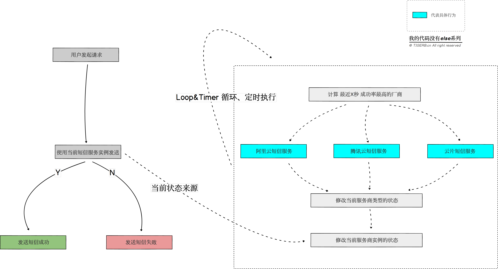

## 状态模式

### 1.什么是状态模式

    不同的算法按照统一的标准封装，根据不同的内部状态，决策使用何种算法

[状态模式]和[策略模式]区别

    策略模式：依靠客户决策
    状态模式：依靠内部状态决策

### 2.什么真是业务场景可以使用[状态模式]

具体算法的选取是由内部状态决定的

    首先，内部存在多种状态
    其次，不同的状态的业务逻辑各不相同

比如，发送短信接口、限流等等。

- 短信接口

    服务内部根据最优算法，实时推举出最优的短信服务商，并修改使用何种短信服务商的状态

- 限流

    服务内部根据当前的实时流量，选择不同的限流算法，并修改使用何种限流算法的状态


### 3.怎么使用状态模式(以短信验证码为例)

    业务梳理
    业务流程图
    代码建模
    代码

- 业务梳理

    发送短信，用户只需要输入手机号即可
    至于短信服务使用何种短信服务商，是由短信服务自身的当前短信服务商实例的状态决定
    当前短信服务商实例的状态又是由服务自身的算法修改

- 业务流程图



- 代码建模

「状态模式」的核心是：

一个接口:

    短信服务接口SmsServiceInterface

一个实体类:

    状态管理实体类StateManager


伪代码如下：

    // 定义一个短信服务接口
    - 接口`SmsServiceInterface`
        + 抽象方法`Send(ctx *Context) error`发送短信的抽象方法

    // 定义具体的短信服务实体类 实现接口`SmsServiceInterface`

    - 实体类`ServiceProviderAliyun`
        + 成员方法`Send(ctx *Context) error`具体的发送短信逻辑
    - 实体类`ServiceProviderTencent`
        + 成员方法`Send(ctx *Context) error`具体的发送短信逻辑
    - 实体类`ServiceProviderYunpian`
        + 成员方法`Send(ctx *Context) error`具体的发送短信逻辑

    // 定义状态管理实体类`StateManager` (😅，这里之后不懂)
    - 成员属性
        + `currentProviderType ProviderType`当前使用的服务提供商类型
        + `currentProvider SmsServiceInterface`当前使用的服务提供商实例
        + `setStateDuration time.Duration`更新状态时间间隔
    - 成员方法
        + `initState(duration time.Duration)`初始化状态
        + `setState(t time.Time)`设置状态


```golang
type Context struct {
	Tel        string // 手机号
	Text       string // 短信内容
	TemplateID string // 短信模板ID
}

// 短信服务接口
type SmsServiceInterface interface {
	Send(c *Context) error
}

// 阿里云
type AliyunServiceProvider struct{}

func (s *AliyunServiceProvider) Send(ctx *Context) error {
	fmt.Println(runFuncName(), "【阿里云】短信发送成功，手机号:"+ctx.Tel)
	return nil
}

// 腾讯云
type TencentServiceProvider struct{}

func (s *TencentServiceProvider) Send(ctx *Context) error {
	fmt.Println(runFuncName(), "【腾讯云】短信发送成功，手机号:"+ctx.Tel)
	return nil
}

// AWS
type AWSServiceProvider struct{}

func (s *AWSServiceProvider) Send(ctx *Context) error {
	fmt.Println(runFuncName(), "【AWS】短信发送成功，手机号:"+ctx.Tel)
	return nil
}

// 短信服务提供商类型
type ProviderType string

const (
	ALIYUN  ProviderType = "aliyun"
	AWS     ProviderType = "aws"
	TENCENT ProviderType = "tencent"
)

var (
	// 当前使用的服务提供商实例
	stateManegerInstance *StateManager
)

// 定义状态管理实体类`StateManager`
type StateManager struct {
	// 当前使用的服务提供商类型
	currentProviderType ProviderType
	// 当前使用的服务提供商实例
	currentProvider SmsServiceInterface
	// 更新状态时间间隔
	setStateDuration time.Duration
}

func (m *StateManager) initState(duration time.Duration) {
	m.setStateDuration = duration
	m.setState(time.Now())
	// 定时更新状态(question:这里不懂😅)
	go func() {
		for {
			select {
			// 每一段时间后根据回调的发送成功率 计算得到当前应该使用的服务商
			case t := <-time.NewTicker(m.setStateDuration).C:
				m.setState(t)
			}
		}
	}()
}

// 根据回调的发送成功率 计算得到下阶段应该使用的服务商
func (m *StateManager) setState(t time.Time) {
	ProviderTypeArray := [3]ProviderType{
		ALIYUN,
		TENCENT,
		AWS,
	}

	m.currentProviderType = ProviderTypeArray[rand.Intn(len(ProviderTypeArray))]

	switch m.currentProviderType {
	case ALIYUN:
		m.currentProvider = &AliyunServiceProvider{}
	case TENCENT:
		m.currentProvider = &TencentServiceProvider{}
	case AWS:
		m.currentProvider = &AWSServiceProvider{}
	default:
		panic("非法的短信服务商")
	}

	fmt.Printf("时间：%s| 变更短信发送厂商为: %s \n", t.Format("2006-01-02 15:04:05"), m.currentProviderType)
}

func (m *StateManager) getState() SmsServiceInterface {
	return m.currentProvider
}

func GetState() SmsServiceInterface {
	return stateManegerInstance.getState()
}

func main() {
	// 初始化状态管理
	stateManegerInstance = &StateManager{}
	stateManegerInstance.initState(300 * time.Millisecond)

	// 模拟发送短信的接口
	sendSms := func() {
		GetState().Send(&Context{
			Tel:        "13999999999",
			Text:       "z-mino",
			TemplateID: "mino_01",
		})
	}

	// 模拟用户调用发送短信的接口
	sendSms()
	time.Sleep(1 * time.Second)
	sendSms()
	time.Sleep(1 * time.Second)
	sendSms()
	time.Sleep(1 * time.Second)
	sendSms()
	time.Sleep(1 * time.Second)
	sendSms()
	time.Sleep(1 * time.Second)
	sendSms()
}

// 获取正在运行的函数名
func runFuncName() string {
	pc := make([]uintptr, 1)
	runtime.Callers(2, pc)
	f := runtime.FuncForPC(pc[0])
	return f.Name()
}

```